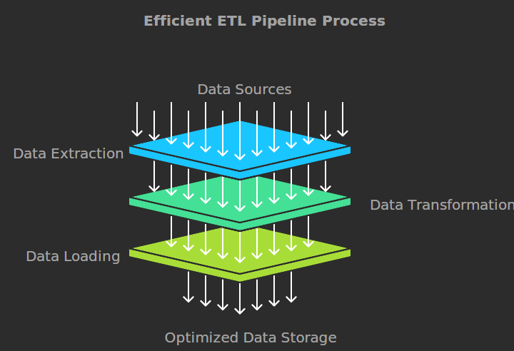

# ETL-Pipeline-Project-with-Databricks-and-PySpark

This project demonstrates creating efficient and scalable ETL (Extract, Transform, Load) pipelines using Databricks with PySpark, and Apache Spark’s Python API. The pipelines use a factory pattern to accommodate multiple data sources and employ advanced transformation and loading strategies in DataLake and LakeHouse environments. The project also covers frequently asked PySpark interview concepts such as joins, window functions, partitioning, bucketing, and Delta Lake usage.

#Table of Contents

Project Overview
Architecture and Design
Technologies Used
Project Setup
Data Sources
ETL Pipeline Stages
Key Concepts

Architecture and Design
We have used the Factory Pattern to design a flexible ETL pipeline that can adapt to different data sources and transformations. The factory pattern allows us to define a common reader interface, making it easier to add new sources without modifying the core ETL code.

Technologies Used
Databricks: Provides a collaborative environment with optimized Apache Spark
Apache Spark: Used for distributed data processing
PySpark: Spark’s Python API for data manipulation and transformations
DataLake and LakeHouse: Storage solutions for managing structured and semi-structured data
Delta Lake: Storage layer that brings ACID transactions to Apache Spark and big data workloads

The project demonstrates data extraction from the following sources:

CSV Files
Parquet Files
Delta Tables
ETL Pipeline Stages
Extraction: Using the Factory Pattern, each data source has a dedicated reader class, making the process modular and extensible.
Transformation: Business logic transformations are implemented using PySpark DataFrame API and Spark SQL.
Loading: Data is loaded into both DataLake and LakeHouse formats for different use cases.
Key Concepts
This project demonstrates the following important PySpark concepts and data engineering patterns:

Factory Pattern for handling multiple data sources
DataFrame API and Spark SQL for transformations
Broadcast Joins for optimizing joins with smaller datasets
Partitioning and Bucketing to improve data distribution and performance
Window Functions (LAG, LEAD) for complex analytics
SparkSession management
Delta Table operations for ACID-compliant transactions
